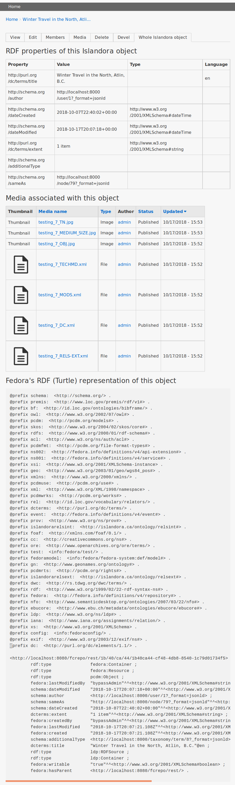

# Islandora Whole Object

## Introduction

A first attempt at addressing https://github.com/Islandora-CLAW/CLAW/issues/886. Mainly me learning Islandora CLAW's data structures and how to render them in a Drupal 8 module.

## Requirements

* [Islandora](https://github.com/Islandora-CLAW/islandora) a.k.a. CLAW

## Installation

1. Clone this repo into your Islandora's `drupal/web/modules/contrib` directory.
1. Enable the module either under the "Admin > Extend" menu or by running `drush en -y islandora_whole_object`.

## Usage

After you enable this module, a "Whole Islandora Object" tab will appear on Islandora objects, for users with 'administer site configuration' permission. Clicking the link in that tab will provide the RDF properties of the current object, all media linked to the object, and Fedora's RDF representation of the object:

## Other representations

To get a sense of the different ways we might represent the linked data properties of an Islandora object, you can use a simple way to see different represtations of that data. Appending the following to the end of `/node/1/whole_islandora_object` (e.g., `/node/1/whole_islandora_object/table`) will result in different outputs:

* `table` (or nothing at the end of the URL): show the Linked Data properties in a table (currently only show first of multivalued properties) as illustrated above 
* `jsonld`:  show the JSON-LD converted to a raw PHP array as illustrated below 
* `node`: doesn't show Linked Data properties, just the basic Drupal node structure as a raw PHP array
* `fedora`: show Fedora's Turle Linked Data representation of the resource

Here's the raw (PHP array) JSON-LD output (e.g., `http://localhost:8000/node/1/whole_islandora_object/jsonld`):

## To do

* Outputing the JSON-LD using https://github.com/scienceai/jsonld-vis would be interesting. See issue #1.
* Add Solr document for the object.
* Add the option of showing the content in a block.
* Make the content types that we can view Whole Objects for configurable (currently it only shows on nodes of type 'islandora_object').

## Current maintainer

* [Mark Jordan](https://github.com/mjordan)

## License

[GPLv2](http://www.gnu.org/licenses/gpl-2.0.txt)
