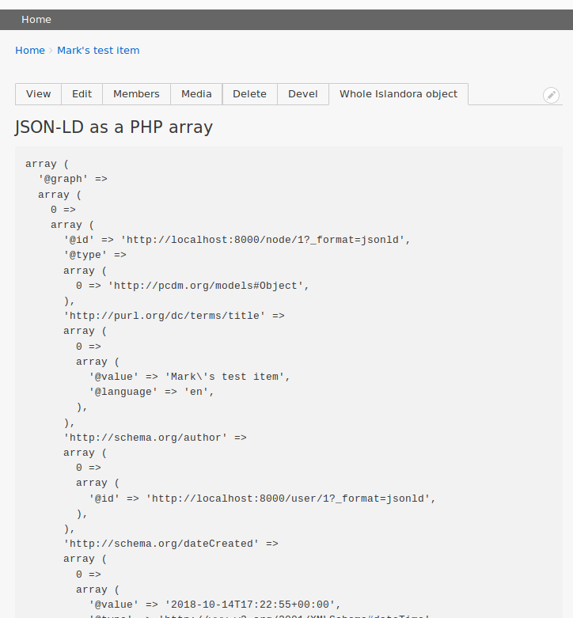

# Islandora Whole Object

## Introduction

An first attempt at addressing https://github.com/Islandora-CLAW/CLAW/issues/886. Mainly me learning how to to understand Islandora's data structures and render them in a Drupal 8 module.

## Requirements

* [Islandora](https://github.com/Islandora-CLAW/islandora) aka CLAW
* [Devel](https://www.drupal.org/project/devel)

## Installation

1. Clone this repo into your CLAW's `drupal/web/modules/contrib` directory.
1. Enable the module either under the "Admin > Extend" menu or by running `drush en -y islandora_whole_object`.

## Usage

After you enable this module, a "Whole Islandora Object" tab will appear (for users with 'administer site configuration' permission) on objects:

Clicking the link in that tab will show you the JSON-LD of the current object, e.g.:

That's currently all it does.

## To do

* Make the content types this tab shows on configurable (currently it only shows on nodes of type 'islandora_object')
* Format the content so it's more useful, andby remove our dependency on Devel
* Add more than just the JSON-LD (e.g., thumnails of media, etc.)
* Add the option of showing the content in a block instead of as a tab

## Maintainers

Current maintainers:

* [Mark Jordan](https://github.com/mjordan)

## License

[GPLv2](http://www.gnu.org/licenses/gpl-2.0.txt)
