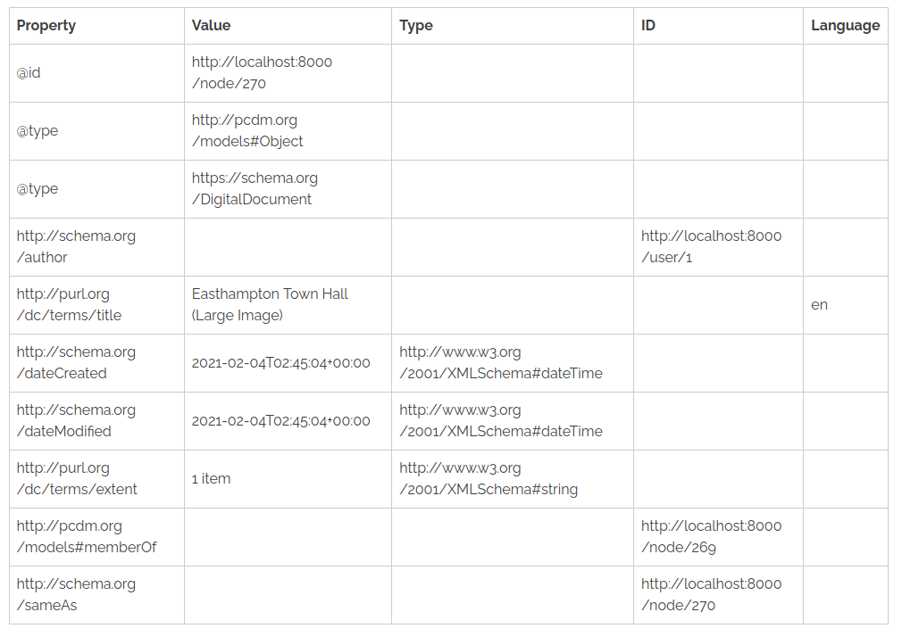

# Islandora Whole Object

## Introduction

Islandora 8 module that provides a set of Drupal blocks containing various representations of an Islandora object:

* a block that contains the Drupal RDF properties in a table (currently only show first of multivalued properties) as illustrated below
* a block listing the media associated with the object (same contents as th "Media" tab)
* a block listing Fedora's Turtle Linked Data representation of the resource
* a block containing the Solr document for the node

This is a sample "Drupal RDF Properties" block:

## Requirements

* [Islandora 8](https://github.com/Islandora-CLAW/islandora)

## Installation

1. Clone this repo into your Islandora's `drupal/web/modules/contrib` directory.
1. Enable the module either under the "Admin > Extend" menu or by running `drush en -y islandora_whole_object`.

## Usage

After you enable this module, some new blocks will show up in your "Block Layout" admin area with the catagory "Islandora":

## Configuration

The blocks provided by this module are standard Drupal blocks, so you can configure them as you like. However, since they contain more information than most blocks do, you should:

* place them in wide regions, such as "Content suffix" (if your theme provides that region)
* configure the blocks so they display only for Islandora content types
* configure the blocks so they display only for specific roles

## To do

* Outputing the JSON-LD using https://github.com/scienceai/jsonld-vis would be interesting. See issue #1.

## Current maintainer

* [Mark Jordan](https://github.com/mjordan)

## License

[GPLv2](http://www.gnu.org/licenses/gpl-2.0.txt)
